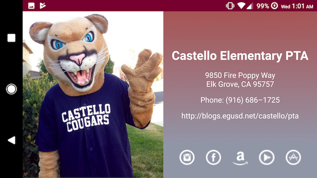

# CastelloPTA - Single Screen App
## Android Basics Nanodegree Course: Project 1
- Project specifications described in [Udacity Project 1 Rubric](docs/Project_1_Rubric.pdf)

## Screenshots
- Taken on Nexus 6 (API 27)
- includes layout variant for landscape mode

